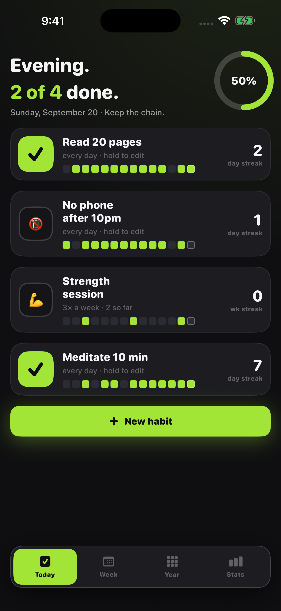
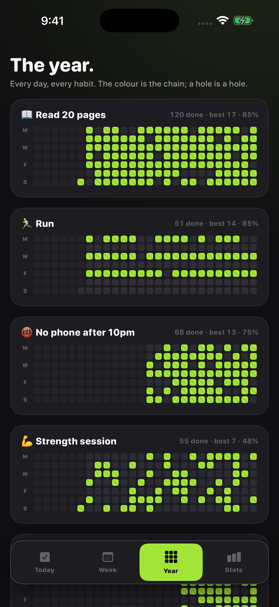
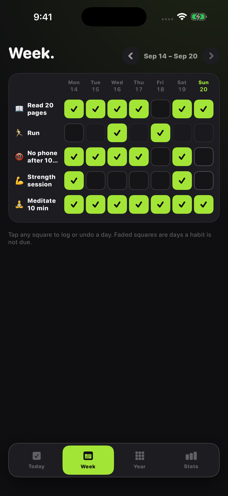

# Chain

A habit tracker for iPhone that turns every habit into a year-long quilt: lime where you showed up, a hole where you did not.

  

**[Download Chain on the App Store](https://apps.apple.com/app/id6814264554)** (version 1.1, which makes it free, is in review)

<p align="center">
  
  
  
</p>

Most habit apps are lists with checkboxes. Chain takes five seconds a day and makes the pattern impossible to ignore: tick the habit, watch the ring fill, keep the chain. Weekly habits count in weeks, so a Tuesday off does not break a three-a-week chain.

## Features

- Today: big tap-to-log tiles, a completion ring for the day, a 14-day strip and the current streak under each habit
- Schedules: every day, certain weekdays, or a number of times a week
- Week: a grid to log or undo any day, faded where a habit is not due
- Year: 26 weeks of squares per habit with totals, best chain and completion rate
- Stats: all-time check-ins, 30-day completion, longest chain, perfect days, and which weekdays you actually do the work
- Twenty icons, start dates and a daily reminder at the hour you pick

## Free and Unlimited

Version 1.1 (in App Store review) makes Chain free, with one optional non-consumable in-app purchase, **Chain Unlimited** (StoreKit 2, `Sources/Purchases.swift`). No subscription.

| Free | Chain Unlimited (one-time) |
| --- | --- |
| Up to 3 habits | Unlimited habits |
| The last 30 days of the quilt | The whole year in the quilt |
| Every other feature: Today, Week, Stats, schedules, icons | Daily reminders (one already set keeps working either way) |

People who bought Chain while it was a paid app are detected with `AppTransaction` (original app version and purchase date) and keep everything unlocked. Entitlements come from `Transaction.currentEntitlements`, so the unlock works offline and a refund takes it away.

## Privacy

Chain makes no network requests of its own; the only traffic is StoreKit talking to Apple for the purchase. No account, no analytics, no ads, no tracking. Habits are saved on the device in `chain.json`. The privacy manifest (`Resources/PrivacyInfo.xcprivacy`) declares no tracking and no collected data types.

## Built without a Mac

This app was written on a Windows PC. No Mac is involved at any point: every build, signature, screenshot and App Store submission runs on GitHub Actions macOS runners, driven by the App Store Connect API.

- **`project.yml`** is an [XcodeGen](https://github.com/yonaskolb/XcodeGen) spec. The `.xcodeproj` is generated on the runner and never committed, so the repo can be edited on any OS and there are no `.pbxproj` merge conflicts.
- **`.github/workflows/build.yml`** runs on every push: picks the newest Xcode 26 and iPhone simulator on the runner, builds, then launches the app once per screen with `-shot <screen>` (sample data, fixed 9:41 status bar) and captures the store screenshots with `simctl`, uploaded as a workflow artifact.
- **`.github/workflows/appstore.yml`** (manual) has three modes: `compile`, `dry_run` (build, sign, upload, do not submit) and `release` (also submits for review). The distribution certificate is imported from a secret into a throwaway keychain; [fastlane](https://fastlane.tools) (`fastlane/Fastfile`) fetches the App Store profile with the API key, sets the build number one above the latest on TestFlight, archives, and uploads the binary with `fastlane/metadata` and the committed `fastlane/screenshots`.
- **`.github/workflows/review-video.yml`** records the App Review screen recording: the app is launched with `-demoAutoplay` and drives its own real screens.
- **`Store/*.py`** talk to the App Store Connect API directly from Windows (Python, `requests` + `PyJWT`): `asc.py` registers the bundle id and pushes metadata, `listing.py` sets the age rating, review details, price and screenshots, `iap.py` creates the in-app purchase, sets its price and submits it, and `signing.py` creates the distribution certificate locally so its private key is never stranded on a disposable runner.

Only one step is manual: Apple's API will not create the app record itself, so that is made once in the App Store Connect web UI.

## Build and run

With a Mac and Xcode 26 (the version CI uses; the app targets iOS 17+):

```bash
brew install xcodegen
xcodegen generate
open Chain.xcodeproj
```

Run the `Chain` scheme on any iPhone simulator. No signing is needed for the simulator; from the command line:

```bash
xcodebuild build -project Chain.xcodeproj -scheme Chain \
  -destination 'platform=iOS Simulator,name=iPhone 16 Pro' CODE_SIGNING_ALLOWED=NO
```

To see it filled with sample data, launch with a screenshot argument, e.g. `xcrun simctl launch booted com.mattbusel.chainhabits -shot today`.

Without a Mac: fork the repo and push. The Build workflow compiles it on a GitHub macOS runner and attaches the screenshots as an artifact.

Shipping your own build needs these repository secrets: `ASC_KEY_ID`, `ASC_ISSUER_ID`, `ASC_KEY_CONTENT` (base64 of the `.p8`), `DEVELOPMENT_TEAM`, `DIST_CERT_P12`, `DIST_CERT_PASSWORD`, plus your own bundle id in `project.yml` and `fastlane/Fastfile`.

## Code map

All app code is in `Sources/` (SwiftUI, Observation, no third-party dependencies).

| File | What it does |
| --- | --- |
| `App.swift` | entry point, tab routing, `-shot` handling, the free-tier gate on new habits |
| `Model.swift` | habits, schedules, streak maths, JSON persistence |
| `Views.swift` | Today, Week, Year, Stats and the habit editor |
| `Purchases.swift` | StoreKit 2 unlock, grandfathering for paid-era buyers, the paywall |
| `Theme.swift` | charcoal and lime palette, the quilt |
| `Demo.swift` | sample data for store screenshots |
| `Autopilot.swift` | drives the real screens for the App Review recording |

`Store/` holds the App Store Connect scripts, `fastlane/` the lanes, listing text and screenshots, `Resources/` the asset catalog and privacy manifest.

---

**More apps built the same way:** [Ironbook](https://github.com/Mattbusel/ironbook), [Quiver](https://github.com/Mattbusel/quiver), [Race Fuel](https://github.com/Mattbusel/race-fuel), [Minder](https://github.com/Mattbusel/minder), [Baseline Ledger](https://github.com/Mattbusel/baseline-ledger), [Fairway Ledger](https://github.com/Mattbusel/fairway-ledger), [Odometer](https://github.com/Mattbusel/odometer), [Rooms](https://github.com/Mattbusel/rooms), [Clockout](https://github.com/Mattbusel/clockout), [Curve](https://github.com/Mattbusel/curve), [Pricebook](https://github.com/Mattbusel/pricebook), [Chores](https://github.com/Mattbusel/chores), [Pawprint](https://github.com/Mattbusel/pawprint), [Pocket Beings](https://github.com/Mattbusel/pocket-beings), [Glyphstorm](https://github.com/Mattbusel/glyphstorm), [Clear the Strait](https://github.com/Mattbusel/clear-the-strait).
